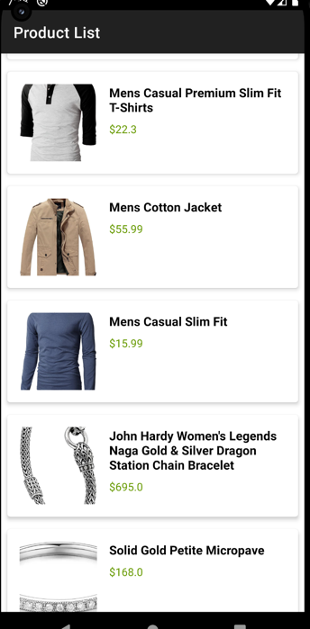

# Product Explorer App

## Project Overview
Product Explorer is an Android application that fetches and displays products from the Fake Store API, with offline caching capabilities.

## Features
- Fetch products from Fake Store API
- View list of products
- View detailed product information
- Offline caching using Room database
- MVVM Architecture
- Dependency Injection with Hilt

## Technical Stack
- Kotlin
- Jetpack Components (Navigation, ViewModel)
- Retrofit for networking
- Room for local database
- Hilt for dependency injection
- Coroutines and Flow for async programming

## Setup Instructions
1. Clone the repository
2. Open in Android Studio
3. Sync Gradle files
4. Run the application

## Screenshots

### Main Screen

### Detail Screen

## Testing
- Unit tests for ViewModel and Repository
